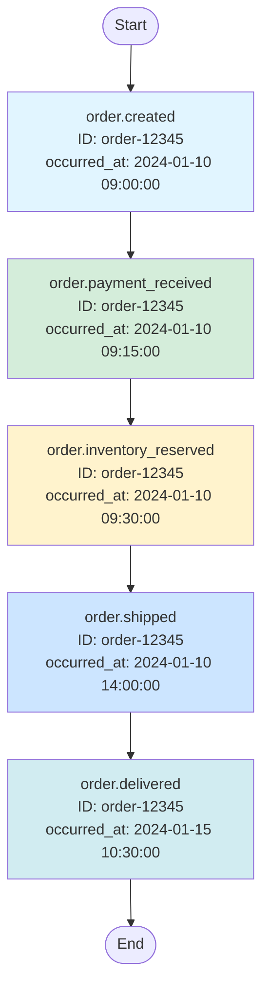

# Eventual

An Elixir event store library for persisting and retrieving domain events with snapshotting support. Eventual provides a clean API for event sourcing patterns with a separate database connection isolated from your host application.

## Features

- **Event Persistence** - Save and retrieve domain events with rich metadata
- **Snapshot Support** - Create snapshots for efficient state reconstruction
- **Flexible Querying** - Filter events by type, aggregate, time range, and more
- **Batch Operations** - Save multiple events in a single transaction
- **State Reconstruction** - Rebuild aggregate state from snapshots and events
- **Streaming Support** - Memory-efficient event streaming for large datasets
- **Separate Database** - Isolated event store database connection
- **Append-Only** - Immutable event log (no updates or deletes)
- **Diagram Generation** - Generate Mermaid diagrams from event sequences for visualization

## Installation

Add `eventual` to your list of dependencies in `mix.exs`:

```elixir
def deps do
  [
    {:eventual, "~> 0.1.0"}
  ]
end
```

## Quick Start

### 1. Configure Database

Configure your event store database in `config/config.exs`:

```elixir
config :eventual, Eventual.Repo,
  database: "eventual_events",
  username: "postgres",
  password: "postgres",
  hostname: "localhost",
  pool_size: 10
```

### 2. Create Database and Run Migrations

```bash
# Create the database
mix ecto.create -r Eventual.Repo

# Run migrations
mix ecto.migrate -r Eventual.Repo
```

### 3. Start Using the API

```elixir
# Save an event
{:ok, event} = Eventual.save_event(
  "user.created",
  "user-123",
  "User",
  %{name: "John Doe", email: "john@example.com"}
)

# Retrieve events for an aggregate
events = Eventual.get_aggregate_events("User", "user-123")

# Create a snapshot
state = %{name: "John Doe", email: "john@example.com", balance: 1000}
{:ok, snapshot} = Eventual.save_snapshot("User", "user-123", state, 100)

# Rebuild state efficiently
{snapshot, events} = Eventual.get_aggregate_state("User", "user-123")
```

## Documentation

For detailed usage examples and patterns, see [USAGE.md](USAGE.md).

## API Overview

### Event Operations

- `save_event/5` - Save a single event
- `save_events/1` - Batch save events in a transaction
- `get_event/1` - Retrieve event by ID
- `list_events/1` - List events with filters
- `stream_events/1` - Stream events efficiently
- `get_aggregate_events/3` - Get all events for an aggregate

### Snapshot Operations

- `save_snapshot/5` - Save aggregate state snapshot
- `get_latest_snapshot/2` - Get most recent snapshot
- `get_snapshot_at/3` - Get snapshot at specific sequence
- `list_snapshots/3` - List all snapshots for an aggregate

### State Reconstruction

- `get_aggregate_state/2` - Get snapshot + subsequent events
- `rebuild_from_snapshot/4` - Rebuild state using custom event handlers

### Diagram Generation

- `generate_timeline/2` - Generate Mermaid timeline diagram
- `generate_flowchart/2` - Generate Mermaid flowchart diagram
- `generate_sequence_diagram/2` - Generate Mermaid sequence diagram
- `generate_state_diagram/2` - Generate Mermaid state diagram
- `generate_graph/2` - Generate Mermaid graph showing aggregate relationships

**Example Event Chain Visualization:**

```elixir
# Get events for an order
events = Eventual.get_aggregate_events("Order", "order-12345")

# Generate flowchart diagram (ordered by sequence_number or occurred_at)
diagram = Eventual.generate_flowchart(events, direction: :TD)
IO.puts(diagram)
```



## Testing

The library includes comprehensive tests. To run them:

```bash
# Start PostgreSQL (if not already running)
./scripts/start_postgres.sh

# Create test database and run migrations
MIX_ENV=test mix ecto.create -r Eventual.Repo
MIX_ENV=test mix ecto.migrate -r Eventual.Repo

# Run tests
mix test
```

The test suite demonstrates:
- Saving and retrieving events
- Batch event operations
- Event filtering and querying
- Snapshot creation and retrieval
- State reconstruction from snapshots
- All edge cases and error handling

## Architecture

```
lib/eventual/
├── application.ex    # OTP Application with supervision tree
├── repo.ex          # Ecto Repo for separate event database
├── event.ex         # Event schema and validations
├── snapshot.ex      # Snapshot schema and validations
├── query.ex         # Query builders for filtering
├── mermaid.ex       # Mermaid diagram generation
└── eventual.ex      # Public API

priv/repo/migrations/
├── *_create_events.exs     # Events table migration
└── *_create_snapshots.exs  # Snapshots table migration
```

## Database Schema

### Events Table

- `id` - UUID primary key
- `event_type` - Event name (e.g., "user.created")
- `aggregate_id` - Entity ID
- `aggregate_type` - Entity type (e.g., "User")
- `data` - Event payload (JSONB)
- `metadata` - Additional context (JSONB)
- `sequence_number` - Ordering within aggregate
- `occurred_at` - Event timestamp
- `inserted_at` - Database insertion time

### Snapshots Table

- `id` - UUID primary key
- `aggregate_id` - Entity ID
- `aggregate_type` - Entity type
- `data` - Computed state (JSONB)
- `sequence_number` - Last event sequence included
- `metadata` - Optional metadata (JSONB)
- `inserted_at` - Snapshot creation time

## License

Copyright © 2025

