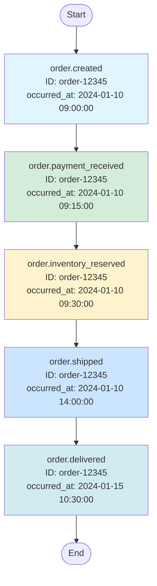
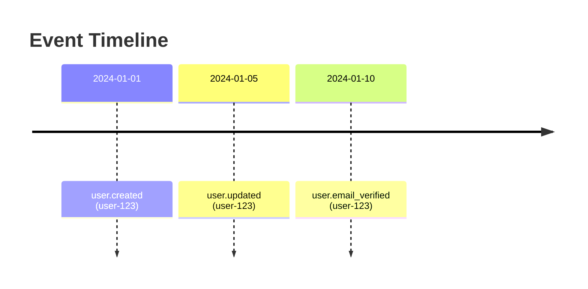
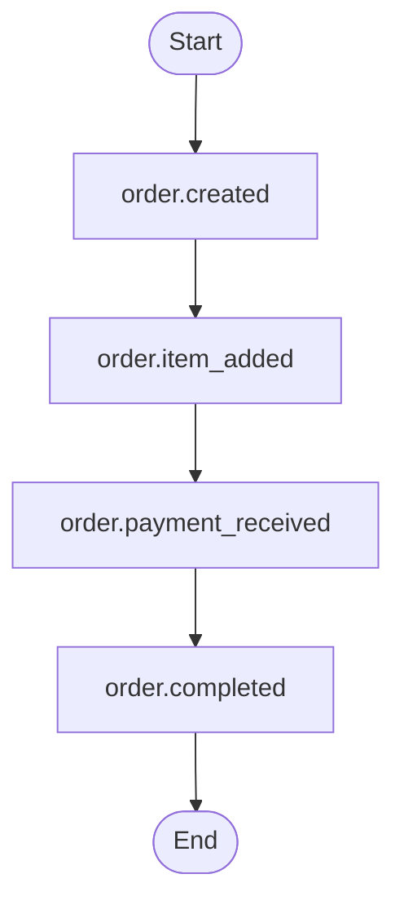
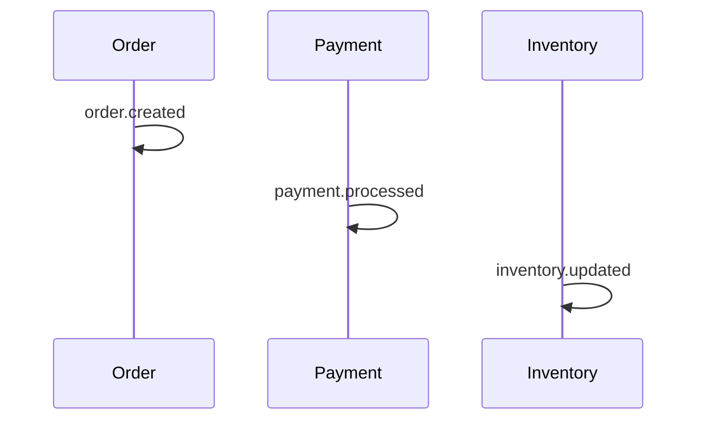
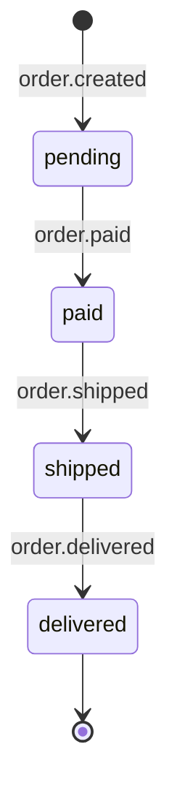
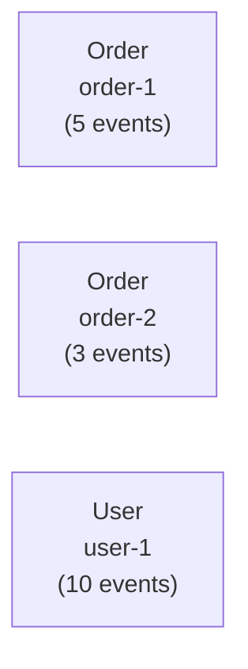

# Eventual - Usage Guide

This guide demonstrates how to use the Eventual event store library in your Elixir applications.

## Setup

### 1. Add to Dependencies

```elixir
# mix.exs
def deps do
  [
    {:eventual, "~> 0.1.0"}
  ]
end
```

### 2. Configure Database

```elixir
# config/config.exs
config :eventual, Eventual.Repo,
  database: "eventual_events",
  username: "postgres",
  password: "postgres",
  hostname: "localhost",
  port: 5432,
  pool_size: 10
```

### 3. Create Database and Run Migrations

```bash
# Create the database
mix ecto.create -r Eventual.Repo

# Run migrations
mix ecto.migrate -r Eventual.Repo
```

## Basic Usage

### Saving Events

```elixir
# Save a single event
event = %Eventual.Event{
  event_type: "user.created",
  aggregate_id: "user-123",
  aggregate_type: "User",
  data: %{
    name: "John Doe",
    email: "john@example.com"
  }
}
{:ok, saved_event} = Eventual.save_event(event)

# Save event with metadata
event = %Eventual.Event{
  event_type: "order.placed",
  aggregate_id: order_id,
  aggregate_type: "Order",
  data: %{items: ["item1", "item2"], total: 99.99},
  metadata: %{user_id: "user-123", ip: "192.168.1.1"}
}
{:ok, saved_event} = Eventual.save_event(event)

# Save event with custom timestamp
event = %Eventual.Event{
  event_type: "payment.completed",
  aggregate_id: payment_id,
  aggregate_type: "Payment",
  data: %{amount: 50.00, method: "credit_card"},
  occurred_at: ~U[2024-01-15 10:30:00Z]
}
{:ok, saved_event} = Eventual.save_event(event)
```

### Batch Saving Events

```elixir
# Save multiple events in a transaction
events = [
  %Eventual.Event{
    event_type: "user.created",
    aggregate_id: "user-1",
    aggregate_type: "User",
    data: %{name: "Alice"}
  },
  %Eventual.Event{
    event_type: "user.created",
    aggregate_id: "user-2",
    aggregate_type: "User",
    data: %{name: "Bob"}
  }
]

{:ok, saved_events} = Eventual.save_events(events)
```

### Retrieving Events

```elixir
# Get a specific event by ID
{:ok, event} = Eventual.get_event(event_id)

# Get all events for a specific aggregate
events = Eventual.get_aggregate_events("User", "user-123")

# Get events with filters
events = Eventual.list_events(
  event_type: "user.created",
  limit: 10
)

# Get events by aggregate type
events = Eventual.list_events(
  aggregate_type: "Order",
  from: ~U[2024-01-01 00:00:00Z],
  to: ~U[2024-12-31 23:59:59Z]
)

# Stream large result sets
Eventual.stream_events(aggregate_type: "User")
|> Stream.map(&process_event/1)
|> Stream.run()
```

## Working with Snapshots

### Creating Snapshots

```elixir
# After processing many events, save a snapshot of the current state
user_state = %{
  id: "user-123",
  name: "John Doe",
  email: "john@example.com",
  balance: 1000.00,
  orders_count: 50
}

snapshot = %Eventual.Snapshot{
  aggregate_type: "User",
  aggregate_id: "user-123",
  data: user_state,
  sequence_number: 100  # last event processed
}
{:ok, saved_snapshot} = Eventual.save_snapshot(snapshot)

# Snapshot with metadata
snapshot = %Eventual.Snapshot{
  aggregate_type: "User",
  aggregate_id: "user-123",
  data: user_state,
  sequence_number: 100,
  metadata: %{created_by: "background_job", reason: "daily_snapshot"}
}
{:ok, saved_snapshot} = Eventual.save_snapshot(snapshot)
```

### Retrieving Snapshots

```elixir
# Get the latest snapshot
{:ok, snapshot} = Eventual.get_latest_snapshot("User", "user-123")

# Get snapshot at specific sequence number
{:ok, snapshot} = Eventual.get_snapshot_at("User", "user-123", 50)

# List all snapshots for an aggregate
snapshots = Eventual.list_snapshots("User", "user-123", limit: 5)
```

## State Reconstruction

### Manual Reconstruction

```elixir
# Get snapshot and subsequent events
{snapshot, events} = Eventual.get_aggregate_state("User", "user-123")

# Manually apply events
state = if snapshot do
  # Start from snapshot state
  Enum.reduce(events, snapshot.data, fn event, state ->
    apply_event_to_user(event, state)
  end)
else
  # No snapshot, start from scratch
  Enum.reduce(events, %{}, fn event, state ->
    apply_event_to_user(event, state)
  end)
end

defp apply_event_to_user(event, state) do
  case event.event_type do
    "user.created" ->
      Map.merge(state, event.data)

    "user.updated" ->
      Map.merge(state, event.data)

    "user.balance_changed" ->
      Map.update!(state, :balance, &(&1 + event.data.amount))

    _ ->
      state
  end
end
```

### Automatic Reconstruction

```elixir
# Use the built-in rebuild function
apply_user_event = fn event, state ->
  case event.event_type do
    "user.created" -> Map.merge(state, event.data)
    "user.updated" -> Map.merge(state, event.data)
    "user.balance_changed" -> Map.update!(state, :balance, &(&1 + event.data.amount))
    _ -> state
  end
end

current_state = Eventual.rebuild_from_snapshot(
  "User",
  "user-123",
  apply_user_event,
  %{}  # initial state if no snapshot exists
)
```

## Complete Example: E-commerce Order Flow

```elixir
defmodule MyApp.OrderService do
  @moduledoc """
  Service for managing orders using event sourcing.
  """

  alias Eventual.Event
  alias Eventual.Snapshot

  # Create a new order
  def create_order(order_id, customer_id, items) do
    event = %Event{
      event_type: "order.created",
      aggregate_id: order_id,
      aggregate_type: "Order",
      data: %{
        customer_id: customer_id,
        items: items,
        status: "pending",
        total: calculate_total(items)
      },
      metadata: %{customer_id: customer_id}
    }

    Eventual.save_event(event)
  end

  # Add item to order
  def add_item(order_id, item) do
    event = %Event{
      event_type: "order.item_added",
      aggregate_id: order_id,
      aggregate_type: "Order",
      data: %{item: item}
    }

    Eventual.save_event(event)
  end

  # Complete the order
  def complete_order(order_id, payment_info) do
    events = [
      %Event{
        event_type: "order.payment_received",
        aggregate_id: order_id,
        aggregate_type: "Order",
        data: %{payment: payment_info}
      },
      %Event{
        event_type: "order.completed",
        aggregate_id: order_id,
        aggregate_type: "Order",
        data: %{completed_at: DateTime.utc_now()}
      }
    ]

    Eventual.save_events(events)
  end

  # Get order history
  def get_order_history(order_id) do
    Eventual.get_aggregate_events("Order", order_id)
  end

  # Rebuild current order state
  def get_current_order_state(order_id) do
    Eventual.rebuild_from_snapshot(
      "Order",
      order_id,
      &apply_order_event/2,
      %{items: [], status: "new", total: 0}
    )
  end

  # Create snapshot after significant changes
  def snapshot_order(order_id, sequence_number) do
    state = get_current_order_state(order_id)

    snapshot = %Snapshot{
      aggregate_type: "Order",
      aggregate_id: order_id,
      data: state,
      sequence_number: sequence_number
    }

    Eventual.save_snapshot(snapshot)
  end

  # Apply order events to rebuild state
  defp apply_order_event(event, state) do
    case event.event_type do
      "order.created" ->
        Map.merge(state, event.data)

      "order.item_added" ->
        items = [event.data.item | state.items]
        total = calculate_total(items)
        %{state | items: items, total: total}

      "order.payment_received" ->
        Map.put(state, :payment, event.data.payment)

      "order.completed" ->
        Map.merge(state, %{status: "completed", completed_at: event.data.completed_at})

      _ ->
        state
    end
  end

  defp calculate_total(items) do
    Enum.reduce(items, 0, fn item, acc -> acc + item.price end)
  end
end
```

## Advanced Querying

### Filter by Time Range

```elixir
# Get events from last week
one_week_ago = DateTime.utc_now() |> DateTime.add(-7, :day)

events = Eventual.list_events(
  event_type: "user.login",
  from: one_week_ago,
  order_by: :occurred_at
)
```

### Pagination

```elixir
# Get first page
page_1 = Eventual.list_events(
  aggregate_type: "Order",
  limit: 10,
  order_by: :inserted_at
)

# Use last event's timestamp for next page
last_event = List.last(page_1)

page_2 = Eventual.list_events(
  aggregate_type: "Order",
  from: last_event.inserted_at,
  limit: 10,
  order_by: :inserted_at
)
```

### Get Events After Snapshot

```elixir
# Efficient: only get events we haven't processed
{:ok, snapshot} = Eventual.get_latest_snapshot("User", user_id)

new_events = Eventual.get_aggregate_events(
  "User",
  user_id,
  from_sequence: snapshot.sequence_number
)
```

## Visualizing Events with Mermaid Diagrams

Eventual provides built-in support for generating [Mermaid](https://mermaid.js.org/) diagrams from event sequences. This is useful for documentation, debugging, and understanding event flows.

### Example: E-commerce Order Event Chain

Here's a real-world example showing a complete order lifecycle visualized as a flowchart:

```elixir
# Save a sequence of order events
order_id = "order-12345"

Eventual.save_events([
  %Eventual.Event{
    event_type: "order.created",
    aggregate_id: order_id,
    aggregate_type: "Order",
    data: %{customer_id: "cust-1", items: ["item-1", "item-2"], total: 99.99}
  },
  %Eventual.Event{
    event_type: "order.payment_received",
    aggregate_id: order_id,
    aggregate_type: "Order",
    data: %{payment_method: "credit_card", amount: 99.99}
  },
  %Eventual.Event{
    event_type: "order.inventory_reserved",
    aggregate_id: order_id,
    aggregate_type: "Order",
    data: %{warehouse: "warehouse-A"}
  },
  %Eventual.Event{
    event_type: "order.shipped",
    aggregate_id: order_id,
    aggregate_type: "Order",
    data: %{carrier: "FedEx", tracking: "TRK123456"}
  },
  %Eventual.Event{
    event_type: "order.delivered",
    aggregate_id: order_id,
    aggregate_type: "Order",
    data: %{delivered_at: "2024-01-15 14:30:00"}
  }
])

# Generate flowchart diagram (automatically ordered by sequence_number or occurred_at)
events = Eventual.get_aggregate_events("Order", order_id)
diagram = Eventual.generate_flowchart(events, direction: :TD)

# Print the diagram
IO.puts(diagram)
```

The command `Eventual.generate_flowchart(events, direction: :TD)` produces the following Mermaid diagram. Note that each event shows its `event_type`, `aggregate_id`, and ordering value. The diagram includes a comment showing whether events are ordered by `sequence_number` or `occurred_at`:

**Rendered Diagram:**



This visualization makes it easy to:
- **Understand the event flow** at a glance
- **Debug issues** by identifying where the process stopped
- **Document business processes** in your codebase
- **Communicate with stakeholders** about system behavior

### Timeline Diagrams

Timeline diagrams show events in chronological order with their timestamps.

```elixir
# Get events for an aggregate
events = Eventual.get_aggregate_events("User", "user-123")

# Generate timeline
diagram = Eventual.generate_timeline(events)
IO.puts(diagram)
```

**Output:**


**Options:**
```elixir
# Custom title
Eventual.generate_timeline(events, title: "User Activity")

# Different date formats
Eventual.generate_timeline(events, date_format: :long)   # 2024-01-01 10:30
Eventual.generate_timeline(events, date_format: :short)  # 2024-01-01 (default)
Eventual.generate_timeline(events, date_format: :timestamp)  # Unix timestamp

# Using filters directly instead of event list
Eventual.generate_timeline(
  aggregate_type: "Order",
  aggregate_id: "order-456"
)
```

### Flowchart Diagrams

Flowcharts show the sequence of events with their relationships and data flow.

```elixir
events = Eventual.get_aggregate_events("Order", "order-456")

# Generate flowchart
diagram = Eventual.generate_flowchart(events)
IO.puts(diagram)
```

**Output:**


**Options:**
```elixir
# Left-to-right flow
Eventual.generate_flowchart(events, direction: :LR)

# Top-down flow (default)
Eventual.generate_flowchart(events, direction: :TD)

# Include event data in nodes
Eventual.generate_flowchart(events, show_data: true)
```

### Sequence Diagrams

Sequence diagrams show interactions between different aggregate types over time.

```elixir
# Get events from multiple aggregates
events = Eventual.list_events(
  event_type: ["order.created", "payment.processed", "inventory.updated"]
)

diagram = Eventual.generate_sequence_diagram(events)
IO.puts(diagram)
```

**Output:**


**Options:**
```elixir
# Include metadata as notes
Eventual.generate_sequence_diagram(events, show_metadata: true)
```

### State Diagrams

State diagrams visualize how an aggregate transitions through different states based on events.

```elixir
events = Eventual.get_aggregate_events("Order", "order-789")

diagram = Eventual.generate_state_diagram(events)
IO.puts(diagram)
```

**Output:**


**Custom State Extraction:**

By default, the state diagram tries to extract state from the `status` field in event data. You can provide a custom extractor:

```elixir
# Custom state extractor function
state_extractor = fn event ->
  case event.event_type do
    "order.created" -> "New"
    "order.paid" -> "Processing"
    "order.shipped" -> "InTransit"
    "order.delivered" -> "Complete"
    _ -> "Unknown"
  end
end

Eventual.generate_state_diagram(events, state_extractor: state_extractor)
```

### Graph Diagrams

Graph diagrams show relationships between different aggregates.

```elixir
# Get all events for a specific event type
events = Eventual.list_events(event_type: "order.created")

diagram = Eventual.generate_graph(events)
IO.puts(diagram)
```

**Output:**


**Options:**
```elixir
# Top-down layout
Eventual.generate_graph(events, direction: :TD)

# Left-right layout (default)
Eventual.generate_graph(events, direction: :LR)
```

### Rendering Mermaid Diagrams

The generated Mermaid syntax can be rendered in various ways:

**1. GitHub/GitLab Markdown:**
```markdown
# Event Flow

```mermaid
<%= Eventual.generate_flowchart(events) %>
` ``
```

**2. LiveBook:**
```elixir
events = Eventual.get_aggregate_events("User", user_id)
diagram = Eventual.generate_timeline(events)

Kino.Mermaid.new(diagram)
```

**3. Save to File:**
```elixir
events = Eventual.get_aggregate_events("Order", order_id)
diagram = Eventual.generate_state_diagram(events)

File.write!("docs/order-state-diagram.md", """
# Order State Flow

```mermaid
#{diagram}
` ``
""")
```

**4. Web Rendering:**
Use the [Mermaid Live Editor](https://mermaid.live/) to paste and render diagrams, or integrate [mermaid.js](https://github.com/mermaid-js/mermaid) into your web application.

### Practical Examples

**Debugging Event Sequences:**
```elixir
# When investigating an issue, visualize the event flow
defmodule Debug do
  def inspect_aggregate(aggregate_type, aggregate_id) do
    events = Eventual.get_aggregate_events(aggregate_type, aggregate_id)

    IO.puts("\n=== Timeline ===")
    IO.puts(Eventual.generate_timeline(events))

    IO.puts("\n=== State Transitions ===")
    IO.puts(Eventual.generate_state_diagram(events))

    IO.puts("\n=== Event Flow ===")
    IO.puts(Eventual.generate_flowchart(events, direction: :LR))
  end
end

Debug.inspect_aggregate("Order", "problematic-order-id")
```

**Documentation Generation:**
```elixir
# Generate documentation for all order states
defmodule Docs.OrderStates do
  def generate do
    # Get a representative order with all state transitions
    events = Eventual.get_aggregate_events("Order", "sample-order")

    diagram = Eventual.generate_state_diagram(events)

    File.write!("docs/order-states.md", """
    # Order State Machine

    This diagram shows all possible states an order can transition through:

    ```mermaid
    #{diagram}
    ` ``

    ## States

    - **pending**: Order created but not yet paid
    - **paid**: Payment received, awaiting fulfillment
    - **shipped**: Order dispatched to customer
    - **delivered**: Order received by customer
    """)
  end
end
```

**Monitoring Event Patterns:**
```elixir
# Visualize recent activity across all users
defmodule Monitor do
  def user_activity_last_hour do
    one_hour_ago = DateTime.utc_now() |> DateTime.add(-3600, :second)

    events = Eventual.list_events(
      aggregate_type: "User",
      from: one_hour_ago,
      limit: 100
    )

    sequence = Eventual.generate_sequence_diagram(events)

    # Send to monitoring dashboard or log
    Logger.info("User activity sequence:\n#{sequence}")
  end
end
```

## Best Practices

### 1. Event Naming
Use clear, past-tense event names:
- ✅ `user.created`, `order.placed`, `payment.completed`
- ❌ `create_user`, `place_order`, `complete_payment`

### 2. Snapshot Strategy
Create snapshots:
- After every N events (e.g., every 100 events)
- On a schedule (e.g., daily for active aggregates)
- Before expensive state reconstructions

### 3. Metadata Usage
Store correlation IDs and causation IDs in metadata:
```elixir
event = %Eventual.Event{
  event_type: "order.created",
  aggregate_id: order_id,
  aggregate_type: "Order",
  data: order_data,
  metadata: %{
    correlation_id: correlation_id,  # Links related events
    causation_id: originating_event_id,  # What caused this event
    user_id: user_id
  }
}

Eventual.save_event(event)
```

### 4. Sequence Numbers
Let the application manage sequence numbers when order matters:
```elixir
# Get next sequence number
last_event = Eventual.get_aggregate_events("User", user_id, limit: 1)
next_seq = if last_event, do: last_event.sequence_number + 1, else: 1

event = %Eventual.Event{
  event_type: "user.updated",
  aggregate_id: user_id,
  aggregate_type: "User",
  data: data,
  sequence_number: next_seq
}

Eventual.save_event(event)
```

### 5. Transaction Boundaries
Use `save_events/1` when multiple events must be atomic:
```elixir
# These events must all succeed or all fail together
events = [
  %Eventual.Event{event_type: "inventory.reserved", aggregate_id: order_id, aggregate_type: "Inventory", data: %{...}},
  %Eventual.Event{event_type: "order.created", aggregate_id: order_id, aggregate_type: "Order", data: %{...}},
  %Eventual.Event{event_type: "payment.pending", aggregate_id: order_id, aggregate_type: "Payment", data: %{...}}
]

{:ok, _} = Eventual.save_events(events)
```

## Troubleshooting

### Database Connection Issues
```elixir
# Test the connection
Eventual.Repo.query("SELECT 1")

# Check if repo is running
Process.whereis(Eventual.Repo)
```

### Event Replay Performance
If event replay is slow:
1. Create more frequent snapshots
2. Add database indexes for your query patterns
3. Use `stream_events/1` instead of `list_events/1`

### Viewing Events in Database
```sql
-- See all events for a user
SELECT * FROM events
WHERE aggregate_type = 'User'
  AND aggregate_id = 'user-123'
ORDER BY sequence_number;

-- Latest snapshots
SELECT DISTINCT ON (aggregate_type, aggregate_id) *
FROM snapshots
ORDER BY aggregate_type, aggregate_id, sequence_number DESC;
```
